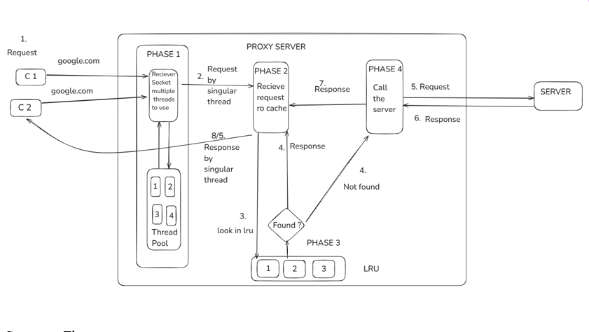

# 🔁 Multithreaded Proxy Server with Optimized Caching

A high-performance, C-based HTTP proxy that handles multiple clients concurrently and speeds up repeat requests with a smart cache—evicting entries by a dynamic score blending access frequency and latency.

## 🎯 PROJECT GOALS & MILESTONES

This project implements a high-performance, multithreaded HTTP proxy cache in C that handles multiple clients concurrently, forwards requests to origin servers, and accelerates repeat access with a custom cache optimized beyond basic LRU by factoring in content frequency and latency.

### Key highlights:
- **Concurrent client handling** via POSIX threads (`pthread.h`)  
- **Efficient request forwarding** over sockets (`sys/socket.h`)  
- **Dynamic-Score Cache** : ranks entries by  
  - **Frequency** (how often requested)  
  - **Latency** (round-trip fetch time)  
  - **Size normalization** (larger objects demoted)  
- **Thread-safe cache** access using mutexes/read-write locks  
- **Configurable** cache size & thread count via CLI or config file  
- **Access logs & performance metrics** for monitoring 

### Milestones
- [x] Implement basic proxy server using sockets.
- [x] Support concurrent clients via threading.
- [x] Parse and forward HTTP GET requests.
- [x] Build optimised cache using a doubly linked list(priority queue) + hash map.
- [x] Ensure thread-safe access to shared cache via mutex/semaphores.
- [x] Add access logs and performance monitoring.
- [x] Make cache/thread count configurable via CLI or config file.
- [ ] Handle large responses and dynamic content.

## SYSTEM ARCHITECTURE



### 🔧 Technologies Used

- **C Standard Libraries** — for memory management and low-level operations.
- **POSIX Threads (`pthread.h`)** — for multithreading and synchronization.
- **Sockets (`sys/socket.h`)** — for network communication.
- **netdb.h** — DNS lookup
- **Linux / Ubuntu (GCC)** — target platform with full POSIX and socket support.

### 🔄 Implementation Strategy

1. **Socket Server**  
   - A main socket listens on a port (e.g., 3490).  
   - Upon each client connection, a new thread is spawned.  
   - Threads use "connection sockets" to process each request independently.

2. **Multithreading**  
   - Each request is handled in parallel using `pthread_create`.  
   - Ensures responsiveness and scalability.

3. **LRU Cache**  
   - Unlike traditional LRU (least-recently used), our cache ranks entries by a dynamic score:
   - Frequency Count: Number of times a resource is requested.
   - Latency Measurement: Round-trip time to fetch if not cached.
   - Size Normalization: Larger objects have proportionally lower priority.
   - Score formula:
   ```text
   score = (frequency × latency_ms) / response_size_bytes
   ```
   - Higher score ⇒ stays in cache longer.
   - Eviction removes lowest-score entry when full.

4. **Thread Safety**  
   - Shared cache access is synchronized using mutexes or read-write locks.  
   - Prevents data corruption and ensures consistent behavior.

5. **End-to-End Flow**

```text
Client → Proxy → Cache Check
       ↳ Cache Hit → Serve
       ↳ Cache Miss → Fetch from Server → Update Cache → Serve
```


## 📌 ASSUMPTIONS

- Runs on POSIX-compliant systems (e.g., Linux).
- All client requests are HTTP `GET` (not `POST`, `CONNECT`, etc.).
- Cache supports static files (HTML, CSS, etc.).
- DNS and network access are available.
- Designed for educational/demo use, not production.
- HTTPS (via `CONNECT`) is out of scope for this version.


## 🧪 TESTING

You can test the proxy using:
```bash
cd proxy
gcc EntryClient.c FetchServer.c Cache.c CallDns.c ClientToServer.c CacheData.c 
```
```bash
./a.out
```
```bash
chmod +x ../proxy/proxy
```
```bash
cd gui
python3 gui.py
```


## 🧪 SAMPLE OUTPUT

Or by configuring your browser’s proxy settings to:
- Proxy server: `localhost`
- Port: `3490`
- Use only HTTP (not HTTPS)

